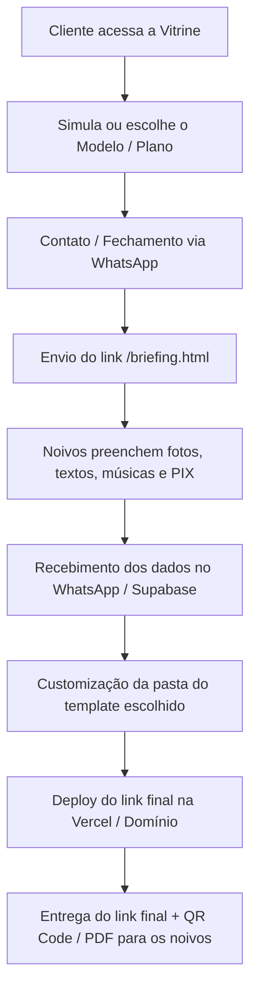

# 💍 Atelier dos Noivos — Plataforma & Portfólio de Convites Digitais Interativos

> **Projeto Comercial Privado — TM Sempre Tecnologia**  
> *Ambiente de Produção:* [portfolioconvites.vercel.app](https://portfolioconvites.vercel.app/)  
> *Status:* Ativo / Comercial

---

## 🎯 Visão Geral do Produto

Plataforma de alta conversão voltada para a comercialização, captação de briefings e entrega de **convites de casamento digitais interativos de luxo**.

O ecossistema reúne em uma única estrutura:
1. **Vitrine de Vendas (*Landing Page Dark Luxury*):** Apresentação dos modelos em mockups interativos com vídeos e simulador de planos.
2. **Formulário de Onboarding & Briefing:** Coleta de dados dos noivos após o fechamento com disparo formatado para WhatsApp e persistência no Supabase.
3. **Hub de Entregáveis & Demos:** Exemplos reais dos pacotes de entrega para demonstração ao cliente.
4. **Motor de Templates:** 8 bases de convites com layouts responsivos, mapas, lista de presentes/PIX, RSVP e áudio player.

---

## 💎 Estrutura de Pacotes & Precificação

| Plano | Valor Sugerido | Entregáveis & Funcionalidades |
| :--- | :---: | :--- |
| **Light** | R$ 99 | Foto principal, dados da cerimônia/festa, integração Google Maps/Waze e RSVP direto via WhatsApp. |
| **Silver** | R$ 149 | Tudo do Light + Player de música (.mp3), galeria de fotos, cronograma do evento, dress code e chave PIX copia e cola. |
| **Gold** | R$ 199 | Tudo do Silver + Vídeo vertical do casal em loop no banner, história do casal (*Storytelling*) e dicas/hospedagem para convidados. |
| **Premium** | R$ 250 | **Experiência Completa:** Vídeo vertical HD + Trilha sonora + Linha do tempo animada + Múltiplos locais + RSVP Inteligente com acompanhantes + QR Code PIX + Cartão Digital em PDF de brinde. |

---

## 🎨 Catálogo dos 8 Templates

| # | Pasta | Arquivo Principal | Estilo / Identidade |
|---|---|---|---|
| **01** | `01-template-2/` | `index.html` | **Royal Gold** — Clássico nobre, marfim & dourado, contagem regressiva formal. |
| **02** | `02-light-design/` | `index.html` | **Minimalist** — Design editorial limpo, foco em fotos e tipografia elegante. |
| **03** | `03-viktor-paula/` | `template5.html` | **Vibrant Vows** — Estilo revista moderna, dinâmico e colorido. |
| **04** | `04-thanu-jathu/` | `jathuandthanu.html` | **Eternal Romance** — Romântico floral, música de fundo e RSVP integrado. |
| **05** | `05-the-sacred-garden/` | `thesacredgarden.html` | **The Sacred Garden** — Casamentos ao ar livre, praia, campo e estilo botânico. |
| **06** | `06-dolce-vita/` | `dolcevita.html` | **Dolce Vita** — Inspiração mediterrânea e clássica italiana. |
| **07** | `07-blossom-oud/` | `blossomoud.html` | **Blossom & Oud** — Dark luxury, atmosfera noturna sofisticada e detalhes refinados. |
| **08** | `08-destination-love/` | `destinationlove.html` | **Destination Love** — Guia de viagem completo, hotéis, rotas e múltiplos mapas. |

---

## ⚡ Fluxo Operacional (Da Venda à Entrega)



1. **Atendimento & Escolha:** O cliente navega pela vitrine ou pelas demos dos planos.
2. **Briefing:** O cliente preenche o formulário online. Os dados chegam estruturados no WhatsApp operacional e salvos no banco.
3. **Montagem do Convite:** Duplicar a pasta do template escolhido, inserir fotos otimizadas, textos, chave PIX e links de localização/RSVP.
4. **Deploy & Publicação:** Publicar na Vercel (tempo médio de montagem: 20 a 35 minutos).
5. **Entrega:** Envio do link final seguro (HTTPS) + Cartão digital interativo com QR Code.

---

## 📂 Estrutura de Diretórios

```text
├── index.html                           # Landing page principal (Vitrine de Vendas)
├── briefing.html                        # Formulário de onboarding dos noivos
├── manual_operacional_e_briefings.html  # Painel interno de precificação e processos
├── styles.css                           # Design System (Cores de luxo, tipografia, responsividade)
├── supabase-config.js                   # Configuração e cliente Supabase
├── supabase_schema.sql                  # Estrutura do banco de dados (Leads & Briefings)
├── vercel.json                          # Configuração de rotas e headers na Vercel
├── marketing/                           # Criativos, copies e materiais de divulgação
├── scripts/                             # Scripts auxiliares e automações
├── exemplos_entregaveis/                # Hub de demonstração dos 4 planos (Light, Silver, Gold, Premium)
└── 01-template-2/ a 08-destination-love/# Templates base de convites
```

---

## 🛠️ Stack Tecnológica & Serviços

- **Frontend:** HTML5 Semântico, CSS3 Moderno, JavaScript Vanilla (ES6+), GSAP Animations.
- **Backend & Persistência:** Supabase (Database Postgres + Auth/Storage para briefings).
- **Hospedagem & CDN:** Vercel (Edge Network, HTTPS automático).
- **Comunicação:** Integração direta com API do WhatsApp (disparos de atendimento).

---

## 💻 Execução Local

Para testar e editar localmente:

```bash
# Utilizando qualquer servidor estático local (ex: npx serve):
npx serve .

# Ou com Python:
python -m http.server 3000
```
Acesse `http://localhost:3000` no seu navegador.

---

## 🔒 Confidencialidade e Direitos de Uso

Este repositório contém código, modelos comerciais e processos operacionais de propriedade exclusiva da **TM Sempre Tecnologia**.

- **Uso Estritamente Privado e Comercial.**
- É proibida a redistribuição, cópia não autorizada ou revenda do código fonte e dos templates sem autorização expressa.